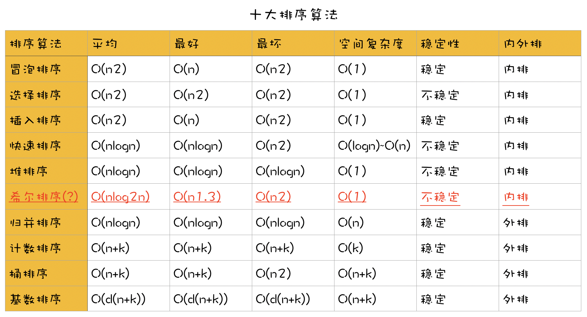

# Basic-Sorting-Algorithm

关于十大基本排序算法的整理。

十大排序算法分别为：冒泡排序，选择排序，插入排序，希尔排序，堆排序，快速排序，归并排序，计数排序，桶排序和基数排序。

排序算法根据相同的值在排序之前和排序之后的前后位置是否不变来表示该排序算法是否稳定，如果不变则是稳定的，否则是不稳定的。

稳定：冒泡排序，插入排序，归并排序，计数排序，桶排序，基数排序

不稳定：选择排序，希尔排序，堆排序，快速排序

排序算法根据排序时所需数据是否一定要全部加载进内存来区分内外排，不需要则是外排，需要则是内排，注意，外排在数据少的时候也可以将需要排序的数据一次性全加载进内存，并不是外排就不可以处理数据少的情况，只是效率高与效率低的问题。

内排：冒泡排序，选择排序，插入排序，希尔排序，堆排序，快速排序

外排：归并排序，计数排序，桶排序，基数排序



计数排序中的k指的是最大数值和最小数值的差值。

桶排序中的k指的是分成多少个桶。

基数排序中的k指的是进制中的基数，比如：十进制就是10。

基数排序中的d指的是最大数值的位数，比如：max=1000，则d=4。

希尔排序的时间复杂度比较有争议性，按照我的理解，希尔排序本质上也是插入排序的一种，也就是当增量=1时，希尔排序最好和最坏分别是：O(n)和O(n2)。

桶排序虽然排序需要遍历k遍，但是由于每个桶可以采取不同的排序方法，比如：统一采取平均时间复杂度为O(nlogn)的排序方法，则平均时间复杂度为：O(O(n+n(logn-logk)))。不仅时间复杂度和桶里数据采取的排序算法有关，连稳定性也是，比如，采取不稳定的算法，就有可能是不稳定的排序算法。

基数排序虽然将排好的数据重新写回去需要遍历k遍，但是，其实还是需要访问n个数据，其实时间复杂度可以写成：O(dn)。

- [冒泡排序](#冒泡排序)
- [选择排序](#选择排序)
- [插入排序](#插入排序)
- [希尔排序](#希尔排序)
- [堆排序](#堆排序)
- [快速排序](#快速排序)
- [归并排序](#归并排序)
- [计数排序](#计数排序)
- [桶排序](#桶排序)
- [基数排序](#基数排序)

## 冒泡排序

第一个元素和第二个元素比较，如果大于则交换两个元素。继续第二个元素和第三个元素比较，如果大于则交换两个元素。相邻的两个元素不断比较，直到最后一个元素是最大的元素。然后，除了最后一个元素，前面的所有元素都重复上面的比较过程，直到整个数列有序。（因为越小的数经过不断比较交换慢慢“潜”到数列前面，像冒泡一样，所以做冒泡排序。）

##### swift实现

```swift
//Swift
func bubbleSort(sortedList: inout [Int]) {
    var i: Int = 1
    var flag = true  //优化

    while i < sortedList.count && flag {
        flag = false
        for j in 0..<sortedList.count-i {
            if sortedList[j] > sortedList[j+1] {
                flag = true
                sortedList.swapAt(j, j+1)
            }
        }
        i++
    }
}
```

##### C实现

```c
//C
void bubbleSort(int arr[], int len) {
    int i = 0, j;
    int flag = 1;

    while (i < len - 1 && flag == 1)
    {
        flag = 0;
        for (j = 0; j < len - 1 - i; j++)
        {
            if (arr[j] > arr[j+1])
            {
                flag = 1;
                swap(&arr[j], &arr[j+1]);
            }
        }
        i++;
    }
}
```

最好时间复杂度：最好的情况就是需要排序的数据完全有序，也就是只需要比较n-1次，移动0次，就可以得到一个完全有序的序列，所以时间复杂度为：O(n)。

最坏时间复杂度：需要排序的数据逆序，那么第一个数据需要比较n-1次，第二个数据需要比较n-2次，那么，总的比较时间为：n-1+n-2+n-3+...+1=(n^2-n)/2，也就是时间复杂度为：O(n^2)。

平均时间复杂度：(O(n)+O(n^2))/2=O(n^2)。

空间复杂度：因为排序是在原数组上进行交换和移动的，也就是不需要额外的辅助空间，严谨来说交换数据时需要一个临时的空间，所以空间复杂度为：O(1)。

稳定性：因为是相邻的元素两两比较，不存在跳跃比较，移动的情况，所以是稳定的排序。

排序类型：因为每次比较需要用到整个数组，换句话说需要把排序的数据一次性加载到内存里进行排序，所以是内排类型。

## 选择排序

选择排序，每次都在无序的数据中选出最小的数据，并排在起始位置，直到所有的数据有序。

##### Swift实现

```swift
//Swift
 func selectSort(sortedList: inout [Int]) {
    for i in 0..<sortedList.count-1 {
        var index = i
        for j in i+1..<sortedList.count {
            if sortedList[j] < sortedList[i] {
                index = j
            }
        }
        sortedList.swapAt(i, index)
    }
 }
```

##### C实现

```c
//C
void selectSort(int arr[], int len) {
    int i, j, min;
    for (i = 0; i < len-1; i++)
    {
        min = i;
        for (j = i + 1; j < len; j++)
        {
            if (arr[min] > arr[j])
            {
                min = j;
            }
        }
        swap(&arr[i], &arr[min]);
    }
}
```

时间复杂度：选择排序比较特殊，无论排序的数据是有序还是无序，时间复杂度都是一样的。因为就算整个数据有序，但是你不将所有的数据比较一次，是不可能知道这个数据就是最大或者最小的，虽然人眼是能看出来，但是机器看不出，所以，时间复杂度为：O(n^2)。

空间复杂度：和冒泡排序一样，最多使用一个数据空间，所以空间复杂度为：O(1)。

稳定性：因为需要在剩下的所有数据中寻找最小值，存在跳跃的情况，比如：2 4 4+ 3 5 => 2 3 4+ 4 5 很明显后面的4跑到前面来了，所以是不稳定的。（因为选择排序是需要在未排序的列表找到最小值的下标，然后和未排序起始值交换，这时候起始值是被换到后面来了，如果它们之间还有和起始值相等的数值，则很明显两个相等数值前后相对位置交换了，所以是不稳定的。）

排序类型：同冒泡排序一样，需要一次性把排序的数据加载到内存，所以是内排。

## 插入排序

插入排序是不断的将数据插入前面有序的序列，形成新的有序序列。

##### Swift实现

```swift
//Swift
func insertSort(sortedList: inout [Int]) {
    for j in 1..<sortedList.count {
        if sortedList[j] < sortedList[j-1] {
            let temp = sortedList[j]
            var i: Int = j-1
            while i >= 0 && sortedList[i] > temp {
                sortedList[i+1] = sortedList[i]
                i--
            }
            sortedList[i+1] = temp
        }
    }
}
```

##### C实现

```c
//C
void insertSort(int arr[], int len) {
    int i, j, tmp;
    for (i = 1; i < len; i++)
    {
        tmp = arr[i];
        for (j = i; j > 0 && arr[j-1] > tmp; j--)
        {
            arr[j] = arr[j-1];
        }
        arr[j] = tmp;
    }
}
```

最好时间复杂度：如果排序的数据完全有序，则只需要比较n-1次，不需要移动数据，则最好的时间复杂度为：O(n)。

最坏时间复杂度：如果排序的数据逆序，从第二数据开始，第一次在比较是否进入循环时，比较了一次，然后在循环比较移动时有比较了一次，也就是两次，总的时间复杂度为：2+3+4+...+n=(n+2)(n-1)/2，时间复杂度为：O(n^2)。

平均时间复杂度：O(n^2)。

稳定性：因为插入排序是一个一个数插入，也是相邻两个数据两两比较，不存在跳跃比较和移动的情况，所以是稳定的。

排序类型：同冒泡排序一样，需要一次性把排序的数据加载到内存，所以是内排。

## 希尔排序

希尔排序是插入排序的升级版，通过设置increment（增量），把数组分成increment组，分别进行插入排序。然后，increment不断的减少，最终一定是increment=1，也就是整个数组进行插入排序，得出有序的序列。（比如：nums[9, 8, 7, 6, 5, 4, 3, 2, 1]，increment=4，则分组：[9, 5, 1]，[8, 4]，[7, 3]，[6, 2]，每组分别进行插入排序，结果为：[1, 5, 9]，[4, 8]，[3, 7]，[2, 6]，整个数组结果为：[1, 4, 3, 2, 5, 8, 7, 6, 9 ]，相对有序，前部分相对小于后部分。）

##### Swift实现

```swift
//希尔排序
func shellSort(sortedList: inout [Int]) {
    let length = sortedList.count
    var increment = length

    repeat{
        increment = increment/3+1
        for i in 0..<length {
            if i >= increment && sortedList[i] < sortedList[i-increment] {
                let temp = sortedList[i]
                var j: Int = i-increment
                while j >= 0 && sortedList[j] > temp {
                    sortedList[j+increment] = sortedList[j]
                    j -= increment
                }
                sortedList[j+increment] = temp
            }
        }
    }while increment > 1
}
```

##### C实现

```c
//C
void shellSort(int arr[], int len) {
    int increment = len;
    int i, j, tmp;

    do
    {
        increment = increment/3 + 1;
        for (i = 1; i < len; i++)
        {
            tmp = arr[i];
            for (j = i; j >= increment && arr[j - increment] > tmp; j = j - increment)
            {
                arr[j] = arr[j - increment];
            }
            arr[j] = tmp;
        }
    } while (increment > 1);
}
```

时间复杂度：因为希尔排序是通过不同的增量来进行分组，然后每组进行插入排序的，也就是说增量的取值直接影响到希尔排序的时间复杂度。但是，在我看来，希尔排序说到底属于插入排，那么一开始increment=1，也就是希尔排序的最好时间复杂度和最坏时间复杂度都是和插入排序相同的，也就是O(n)~O(n^2)，平均时间复杂度比较复杂，由于不同的增量取值，导致时间不一样，有时间复杂度为O(n^1.3)和O(n^1.5)的增量取值，大家可以了解一下。

空间复杂度：和插入排序一样，空间复杂度为O(1)。

稳定性：因为希尔排序是增量插入排序，存在跳跃比较和移动的情况，所以是不稳定的排序。

排序类型：内排。

## 堆排序

堆排序是选择排序的升级版，通过一次次的构建大顶堆，不断获取堆中最大的数据，直到堆中没有数据，也就是所有数据都有序了。

```swift
//堆排序
 func heapSort(sortedList: inout [Int]) {
    sortedList.insert(sortedList.count, at: 0)
    let length = sortedList[0]

    for i in stride(from: length/2, through: 1, by: -1) {
        headAdjust(sortedList: &sortedList, index: i, length: length)
    }

    for i in stride(from: length, to: 1, by: -1) {
        sortedList.swapAt(1, i)
        headAdjust(sortedList: &sortedList, index: 1, length: i-1)
    }

    sortedList.removeFirst()
 }

 func headAdjust(sortedList: inout [Int], index: Int, length: Int) {
    let temp = sortedList[index]
    var s = index;  //根, index从1开始算
    var j = index*2  //左子树
    while j <= length {
        if j < length && sortedList[j] < sortedList[j+1] {
            j++
        }
        if temp >= sortedList[j] {
            break
        }
        sortedList[s] = sortedList[j]
        s = j;
        j = s*2  //左子树
    }
    sortedList[s] = temp
 }
```

最好时间复杂度：开始就是大顶堆，第一次构建，只需要比较，不需要移动，所有的数据至少需要比较一次，时间复杂度为：O(n)。然后，从第二次开始，由于每次都是取叶结点的数据取代根结点，所以，每次都需要比较和移动logi(i为当前构建大顶堆的结点数)，也就是时间复杂度为：log(n-1)+log(n-2)+...+log(1)=log((n-1)!)=(n-1)log(n-1)（nlogn=logn!这个等式证明请自行百度），也就是时间复杂度为：O(nlogn)。

最坏时间复杂度：开始就是小顶堆，第一次构建，每个数据都需要比较和移动，也是O(n)的复杂度。从第二次开始，其实和最好情况的大顶堆是一样的，都需要比较和移动那么多的次数，时间复杂度都是：O(nlogn)。

空间复杂度：因为没有额外的辅助空间，所以，时间复杂度为：O(1)。

稳定性：因为存在跳跃的移动，所以是不稳定的排序。

排序类型：内排。

## 快速排序

快速排序是冒泡排序的升级版（冒泡排序每次只有一个元素沉底，而快速排序则以某个基准为准，多个元素沉底，其他的元素则像泡泡一样往水面移动。），归根到底是比较排序的一种。通过关键数，将数组分成左右两个数组，左边都小于关键数，右边都大于关键数，然后左右两个数组继续分下去，直到所有数据都有序。

##### Swift实现

```swift
 //swift
 func fastSort(sortedList: inout [Int]) {
    sort(sortedList: &sortedList, start: 0, end: sortedList.count-1)
 }

 func sort(sortedList: inout [Int], start: Int, end: Int) {
    if start < end {
        let m = partion(sortedData: &sortedList, start: start, end: end)
        sort(sortedList: &sortedList, start: start, end: m-1)
        sort(sortedList: &sortedList, start: m+1, end: end)
    }
 }

 //pivot = sortedData[start]
 func partion(sortedData: inout [Int], start: Int, end: Int) -> Int {
    let pivot = sortedData[start]
    var left = start
    var right = end

    while left < right {
        while left < right && sortedData[right] >= pivot {
            right--
        }
        sortedData.swapAt(left, right)
        while left < right && sortedData[left] <= pivot {
            left++
        }
        sortedData.swapAt(left, right)
    }
    return left
 }
```

##### C实现

```c
//c
void fastSort(int arr[], int start, int end) {
    if (start > end)
    {
        return;
    }

    int left = start;
    int right = end;
    int pivotkey = arr[left];

    while(left < right)
    {
        while (left < right && arr[right] >= pivotkey)
        {
            right--;
        }
        if (left < right)
        {
            // arr[left++] = arr[right];
            swap(&arr[left++], &arr[right]);
        }

        while (left < right && arr[left] < pivotkey)
        {
            left++;
        }
        if (left < right)
        {
            // arr[right--] = arr[left];
            swap(&arr[right--], &arr[left]);
        }
    }
    // arr[left] = pivotkey;
    fastSort(arr, 0, left-1);
    fastSort(arr, left+1, end);
}
```

最好时间复杂度：快速排序不断的把数组分成两边，相当于一棵二叉树，由二叉树的知识可以知道，完全二叉树的深度最小，为depth =⎣logn⎦+1，也就是说，当数据比较均匀的分布在二叉树的左右两边，则时间复杂度最小。假设快速排序的时间复杂度为：T(n)，第一次需要遍历整个数据，然后把数据分成均匀的两部分，则时间复杂度为：T(n)=2T(n/2)+n，同理，T(n/2)=2T(n/4)+n/2，T(n/4)=2T(n/8)+n/8，则T(n)=2T(n/2)+n=2(2T(n/4)+n/2)+n=4T(n/4)+2n=4(2T(n/8)+n/4)+2n=8T(n/8)+3n=...=nT(n/n)+nlogn=nT(1)+nlogn=nlogn。因为完全二叉树的深度为logn，所以递归调用了logn次，并且直到分到叶子结点，也就是T(1)，T(1)=0，所以，T(n)=nlogn。因此，快速排序的时间复杂度为：O(nlogn)。

最坏时间复杂度：由二叉树的知识可以直到，斜树的深度最大，为depth=n，也就是当整个数组元素构造成一棵斜树，那么，该时间复杂度最高。由最好时间复杂度得出的公式，可以用在最坏时间复杂度的计算，也就是：T(n)=T(n-2)+n-1=T(n-3)+n-1+n-2=T(n-4)+n-1+n-2+n-3=...=n-1+n-2+n-3+...+1=((n-1)*n)/2，所以，最坏时间复杂度为：O(n2)。

空间复杂度：最好的情况，需要进行logn次递归，所以空间复杂度为：O(logn)，最坏的情况，需要进行n-1次递归，所以空间复杂度为：O(n)，因此，空间复杂度为：O(logn)~O(n)。

稳定性：存在数据元素跳跃的问题，是不稳定的排序。

排序类型：内排。

## 归并排序

先没两个数据元素归并成一个有序的整体，然后有序的整体再两两归并成一个更大的有序整体，直到归并所有的数据元素，形成一个有序的整体。

```swift
 //归并排序
 func mergeSort(sortedList: inout [Int]) {
    var result: [Int] = Array.init(repeating: 0, count: sortedList.count)
    sort(sortedList: &sortedList, result: &result, start: 0, end: sortedList.count-1)
 }

 func sort(sortedList: inout [Int], result: inout [Int], start: Int, end: Int) {
    var result2: [Int] = Array.init(repeating: 0, count: MAXSIZE)
    if start == end {
        result[start] = sortedList[start]
    } else {
        let m = (end+start)/2
        sort(sortedList: &sortedList, result: &result2, start: start, end: m)
        sort(sortedList: &sortedList, result: &result2, start: m+1, end: end)
        merge(left: &result2, right: &result, start: start, middle: m, end: end)
    }
 }

 func merge(left: inout [Int], right: inout [Int], start: Int, middle: Int, end: Int) {
    var i = start, j = middle+1, k = start
    while i <= middle && j <= end {
        if left[i] < left[j] {
            right[k] = left[i]
            i++
        } else {
            right[k] = left[j]
            j++
        }
        k++
    }

    if i <= middle {
        for l in 0...middle-i {
            right[k+l] = left[i+l]
        }
    }
    if j <= end {
        for l in 0...end-j {
            right[k+l] = left[j+l]
        }
    }
 }
```

时间复杂度：因为两两归并，其实就是一棵完全二叉树，所以，最好和最坏的时间复杂度都是一样的，二叉树的深度为：logn，并且需要比较n次，所以为：O(nlogn)。

空间复杂度：需要n个额外的辅助空间存结果，并且需要递归logn次，所以空间复杂度为：O(n+logn)，但是如果不采用递归，则需要：O(n)个空间。

稳定性：因为两个有序的整体merge的时候并不涉及到数据的跳跃比较和移动，所以是稳定的。

排序类型：外排，因为不需要刚开始就把所有的数据加载进内存进行排序。

## 计数排序

适用于整数，分布均匀的数据。先找到整个数组最小和最大的整数，然后生（max-min+1）长度的数组，遍历整个数组，最小的放在第一位，最大的放在最后一位，其他数据的位置根据和最小数据的差值放置相应小标的位置，只需遍历一遍就可以把整个数组的数据变成有序。

```swift
//计数排序
 func countSort(sortedList: inout [Int]) {
    let min = sortedList.min()!
    let max = sortedList.max()!
    var result = Array.init(repeating: 0, count: max-min+1)
        //排序
   for num in sortedList {
        result[num-min] = result[num-min]+1;
    }
    //打印
    var result2: [Int] = []
    for (index, value) in result.enumerated() {
        for _ in 0..<value {
            result2.append(index+min)
        }
    }
    print(result2)
 }
```

时间复杂度：排序时间复杂度为O(n)，结果遍历时间复杂度为O(k)（k为最大和最小的差值+1），所以，时间复杂度为：O(n+k)。

空间复杂度：因为需要一个长度为k的数组接收结果，所以，空间复杂度为：O(k)。

稳定性：因为数据是一个个放进去的，相同数字的前后顺序是不变的，所以，是稳定的排序算法。

排序类型：外排，如果直到数据都是在哪一个数据段的，并不需要把所有的数据加载进内存，一个一个数据或者一部分一部分数据加载就可以了。

## 桶排序

计数排序的升级版，计数排序可以看作分成max-min+1个桶的排序。桶排序在计数排序的基础上，将max-min+1的数据段再分成k个桶，每个桶就是一个数据段，所有的桶数据段不会重叠，并且所有桶的数据段连起来就是max-min+1，先将所有数据加入桶里，然后桶里的数据再采用其他排序使桶里的数据有序，然后将所有桶的数据连接起来就是整个有序序列。

```swift
//桶排序
 func bucketSort(sortedList: [Int]) -> [Int] {
    let max = sortedList.max()!
    let min = sortedList.min()!
    let bucketSize = 20
    let bucketCount = (max-min)/bucketSize+1
    var buckets = Array.init(repeating: [Int](), count: bucketCount)
    for num in sortedList {
        let i = (num-min)/bucketSize
        var bucket = buckets[i]
        bucket.append(num)
        buckets[i] = bucket //因为Swift是用时复制，所以需要把bucket重新赋值回去
    }
    var result = [Int]()
    for var bucket in buckets {
        insertSort(sortedList: &bucket) //桶里采用插入排序
        result.append(contentsOf: bucket)
    }
    return result
 }
```

最好时间复杂度：整个数据均匀分布在n个桶里，时间复杂度为：O(n)。

最坏时间复杂度：所有数据都在一个桶里，则时间复杂度为：O(n2)。

平均时间复杂度：遍历需要n遍，排序需要k遍，即时间复杂度为：O(n+km)(m和桶采取的排序算法有关)。假如，桶采取的排序算法平均的时间复杂度为O(nlogn)，则O(n+k(n/k)log(n/k))=O(n+n(logn-logk))=O(n+m)(m=n(logn-logk))。

空间复杂度：需要额外k个桶作为辅助，并且排序结果也需要n个位置储存数据，所以为：O(n+k)。

稳定性：因为桶里的排序用到的是插入排序，所有是稳定的。

排序类型：外排。

## 基数排序

将数字按不同的数位比较，从低位到高位，位数不足的补零。也就是先按照各位排序，然后再按照十位排序，再按照百位排序...直到最高位。

```swift
 func radixSort(sortedList: [Int]) -> [Int] {
    let max = sortedList.max()!
    var result = Array.init(sortedList)
    var buckets = Array.init(repeating: [Int](), count: 10)
    let maxDigit = "\(max)".count
    for i in 0..<maxDigit {  //d
        let mod = (pow(10, i+1) as NSDecimalNumber).intValue
        for num in result { //n
            let j = num%mod/(mod/10)
            var bucket = buckets[j]
            bucket.append(num)
            buckets[j] = bucket
        }
        var index = 0
        for j in 0..<buckets.count {  //k
            let bucket = buckets[j]
            for k in 0..<bucket.count {
                result[index+k] = bucket[k]
            }
            index = index+bucket.count
            buckets[j] = []
        }
    }
    return result
 }
```

时间复杂度：由上面的代码上面可以知道，时间复杂度和maxDigit有关，并且遍历整个数组需要n遍，然后将所有桶的数组按顺序加入结果数组，所以，还需要加上遍历桶的数据的次数，则和k有关。所以，时间复杂度为：O(d(n+k))，k为基数，比如十进制k就是10。

空间复杂度：因为用到了结果数据和基数个桶，所以为：O(n+k)。

稳定性：稳定的，因为不会改变相同两个数据的前后关系。

排序类型：外排。

#### 友情链接：

[JS-Sorting-Algorithm](https://github.com/hustcc/JS-Sorting-Algorithm)

[Play-With-Sort-OC]([https://github.com/MisterBooo/Play-With-Sort-OC](https://github.com/MisterBooo/Play-With-Sort-OC)
